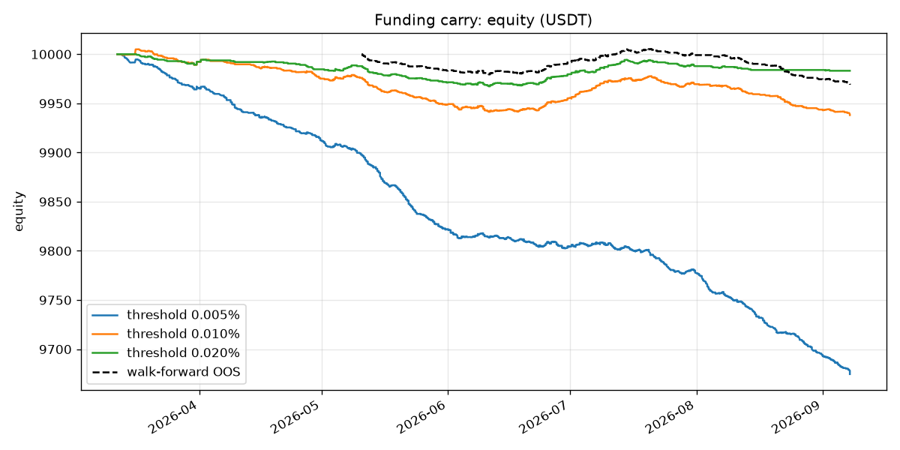

# Funding carry backtest

Generated 2026-09-07 17:19 UTC. Data: 10 symbols, 5,783 funding events, 2026-03-11 → 2026-09-07.

Capital 10,000 USDT, 10 slots × 1,000 USDT, leg notional 500 USDT, leverage 1x. Cost per fill 0.075% (taker 0.055% + spread 0.020%), round trip 0.30% of leg notional. Signal: mean of last 3 settled rates.

## Threshold comparison (full sample, in-sample)

| threshold / interval | APR | max DD | exposure days | slot util. | trades | funding PnL | costs | net PnL |
|---|---|---|---|---|---|---|---|---|
| 0.005% | **-6.60%** | -3.25% | 97.8% | 7.0% | 310 | 139.65 | 465.00 | -325.35 |
| 0.010% | **-1.26%** | -0.67% | 91.7% | 3.0% | 117 | 113.57 | 175.50 | -61.93 |
| 0.020% | **-0.34%** | -0.33% | 65.2% | 1.3% | 63 | 77.67 | 94.50 | -16.83 |

## Per-symbol breakdown (threshold 0.020%)

| symbol | events | trades | held ratio | mean rate | funding PnL | costs | net PnL | APR on slot |
|---|---|---|---|---|---|---|---|---|
| SKHYNIXUSDT | 458 | 22 | 39.1% | 0.0282% | 50.20 | 33.00 | 17.20 | 6.45% |
| BTCUSDT | 540 | 0 | 0.0% | 0.0016% | 0.00 | 0.00 | 0.00 | 0.00% |
| ZECUSDT | 540 | 0 | 0.0% | -0.0029% | 0.00 | 0.00 | 0.00 | 0.00% |
| DOGEUSDT | 540 | 0 | 0.0% | 0.0023% | 0.00 | 0.00 | 0.00 | 0.00% |
| ETHUSDT | 540 | 0 | 0.0% | 0.0016% | 0.00 | 0.00 | 0.00 | 0.00% |
| SOLUSDT | 540 | 0 | 0.0% | -0.0001% | 0.00 | 0.00 | 0.00 | 0.00% |
| XRPUSDT | 540 | 0 | 0.0% | 0.0018% | 0.00 | 0.00 | 0.00 | 0.00% |
| CLUSDT | 466 | 1 | 0.4% | -0.0113% | 0.15 | 1.50 | -1.35 | -0.38% |
| XAUUSDT | 1079 | 12 | 3.3% | 0.0013% | 3.47 | 18.00 | -14.53 | -2.95% |
| SNDKUSDT | 540 | 28 | 26.5% | 0.0122% | 23.85 | 42.00 | -18.15 | -3.69% |

## Walk-forward (out-of-sample)

Train 60d → test 30d, step 30d. Stitched OOS: **APR -0.95%**, max DD -0.36%, exposure days 85.1%, trades 64, net PnL -31.07 USDT over 120 days.

| train start | train end | test end | chosen threshold | train APR | test APR | test max DD | test trades |
|---|---|---|---|---|---|---|---|
| 2026-03-11 | 2026-05-10 | 2026-06-09 | 0.020% | -0.74% | -2.34% | -0.19% | 15 |
| 2026-04-10 | 2026-06-09 | 2026-07-09 | 0.020% | -1.42% | 2.15% | -0.03% | 10 |
| 2026-05-10 | 2026-07-09 | 2026-08-08 | 0.020% | 0.03% | -0.03% | -0.08% | 15 |
| 2026-06-09 | 2026-08-08 | 2026-09-07 | 0.010% | 1.40% | -3.59% | -0.29% | 24 |

## Assumptions

- Spot long and perp short are equal notional; basis / mark-to-market between legs is assumed to net to zero.
- Funding PnL = leg notional × funding rate for every settlement while in position (short receives positive rates).
- Notional is fixed per slot (no compounding); APR = net PnL / capital × 365 / days.
- Signal uses only settled rates (no look-ahead). A position open at the end of the sample is closed and charged exit costs.
