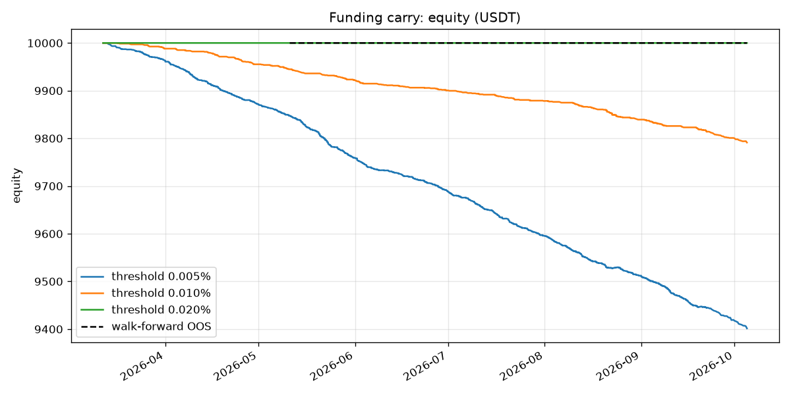

# Funding carry backtest

Generated 2026-10-05 06:46 UTC. Data: 10 symbols, 6,098 funding events, 2026-03-12 → 2026-10-05.

Capital 10,000 USDT, 10 slots × 1,000 USDT, leg notional 500 USDT, leverage 1x. Cost per fill 0.075% (taker 0.055% + spread 0.020%), round trip 0.30% of leg notional. Signal: mean of last 3 settled rates.

## Threshold comparison (full sample, in-sample)

| threshold / interval | APR | max DD | exposure days | slot util. | trades | funding PnL | costs | net PnL |
|---|---|---|---|---|---|---|---|---|
| 0.005% | **-10.55%** | -5.98% | 98.1% | 8.9% | 433 | 51.00 | 649.50 | -598.50 |
| 0.010% | **-3.68%** | -2.09% | 62.0% | 2.0% | 151 | 17.72 | 226.50 | -208.78 |
| 0.020% | **0.00%** | 0.00% | 0.0% | 0.0% | 0 | 0.00 | 0.00 | 0.00 |

## Per-symbol breakdown (threshold 0.020%)

| symbol | events | trades | held ratio | mean rate | funding PnL | costs | net PnL | APR on slot |
|---|---|---|---|---|---|---|---|---|
| ADAUSDT | 622 | 0 | 0.0% | 0.0024% | 0.00 | 0.00 | 0.00 | 0.00% |
| BNBUSDT | 622 | 0 | 0.0% | 0.0033% | 0.00 | 0.00 | 0.00 | 0.00% |
| BTCUSDT | 622 | 0 | 0.0% | 0.0019% | 0.00 | 0.00 | 0.00 | 0.00% |
| DOGEUSDT | 622 | 0 | 0.0% | 0.0026% | 0.00 | 0.00 | 0.00 | 0.00% |
| ETHUSDT | 622 | 0 | 0.0% | 0.0019% | 0.00 | 0.00 | 0.00 | 0.00% |
| NEARUSDT | 582 | 0 | 0.0% | 0.0033% | 0.00 | 0.00 | 0.00 | 0.00% |
| SANDUSDT | 540 | 0 | 0.0% | -0.0131% | 0.00 | 0.00 | 0.00 | 0.00% |
| SOLUSDT | 622 | 0 | 0.0% | 0.0001% | 0.00 | 0.00 | 0.00 | 0.00% |
| XRPUSDT | 622 | 0 | 0.0% | 0.0023% | 0.00 | 0.00 | 0.00 | 0.00% |
| ZECUSDT | 622 | 0 | 0.0% | -0.0020% | 0.00 | 0.00 | 0.00 | 0.00% |

## Walk-forward (out-of-sample)

Train 60d → test 30d, step 30d. Stitched OOS: **APR 0.00%**, max DD 0.00%, exposure days 0.0%, trades 0, net PnL 0.00 USDT over 147 days.

| train start | train end | test end | chosen threshold | train APR | test APR | test max DD | test trades |
|---|---|---|---|---|---|---|---|
| 2026-03-12 | 2026-05-11 | 2026-06-10 | 0.020% | 0.00% | 0.00% | 0.00% | 0 |
| 2026-04-11 | 2026-06-10 | 2026-07-10 | 0.020% | 0.00% | 0.00% | 0.00% | 0 |
| 2026-05-11 | 2026-07-10 | 2026-08-09 | 0.020% | 0.00% | 0.00% | 0.00% | 0 |
| 2026-06-10 | 2026-08-09 | 2026-09-08 | 0.020% | 0.00% | 0.00% | 0.00% | 0 |
| 2026-07-10 | 2026-09-08 | 2026-10-05 | 0.020% | 0.00% | 0.00% | 0.00% | 0 |

## Assumptions

- Spot long and perp short are equal notional; basis / mark-to-market between legs is assumed to net to zero.
- Funding PnL = leg notional × funding rate for every settlement while in position (short receives positive rates).
- Notional is fixed per slot (no compounding); APR = net PnL / capital × 365 / days.
- Signal uses only settled rates (no look-ahead). A position open at the end of the sample is closed and charged exit costs.
