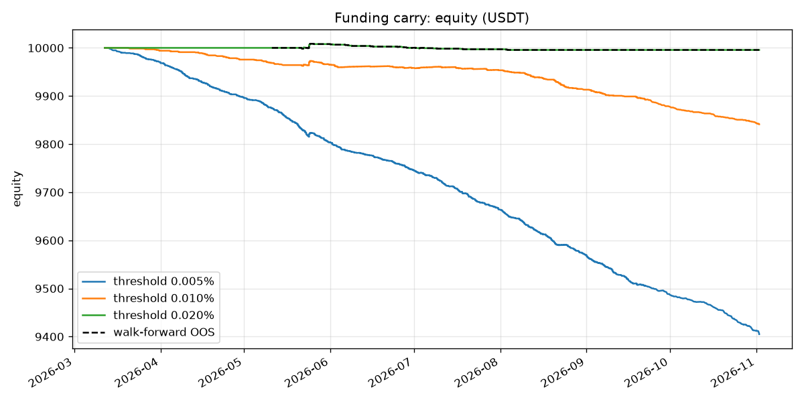

# Funding carry backtest

Generated 2026-11-02 07:32 UTC. Data: 10 symbols, 6,663 funding events, 2026-03-12 → 2026-11-02.

Capital 10,000 USDT, 10 slots × 1,000 USDT, leg notional 500 USDT, leverage 1x. Cost per fill 0.075% (taker 0.055% + spread 0.020%), round trip 0.30% of leg notional. Signal: mean of last 3 settled rates.

## Threshold comparison (full sample, in-sample)

| threshold / interval | APR | max DD | exposure days | slot util. | trades | funding PnL | costs | net PnL |
|---|---|---|---|---|---|---|---|---|
| 0.005% | **-9.24%** | -5.95% | 97.9% | 9.4% | 451 | 81.45 | 676.50 | -595.04 |
| 0.010% | **-2.47%** | -1.59% | 72.9% | 2.7% | 135 | 43.69 | 202.50 | -158.81 |
| 0.020% | **-0.07%** | -0.13% | 11.0% | 0.2% | 13 | 15.16 | 19.50 | -4.34 |

## Per-symbol breakdown (threshold 0.020%)

| symbol | events | trades | held ratio | mean rate | funding PnL | costs | net PnL | APR on slot |
|---|---|---|---|---|---|---|---|---|
| BNBUSDT | 706 | 0 | 0.0% | 0.0032% | 0.00 | 0.00 | 0.00 | 0.00% |
| BTCUSDT | 706 | 0 | 0.0% | 0.0022% | 0.00 | 0.00 | 0.00 | 0.00% |
| DOGEUSDT | 706 | 0 | 0.0% | 0.0027% | 0.00 | 0.00 | 0.00 | 0.00% |
| ETHUSDT | 706 | 0 | 0.0% | 0.0020% | 0.00 | 0.00 | 0.00 | 0.00% |
| NEARUSDT | 666 | 0 | 0.0% | 0.0038% | 0.00 | 0.00 | 0.00 | 0.00% |
| SOLUSDT | 706 | 0 | 0.0% | 0.0004% | 0.00 | 0.00 | 0.00 | 0.00% |
| UNIUSDT | 540 | 0 | 0.0% | 0.0033% | 0.00 | 0.00 | 0.00 | 0.00% |
| XRPUSDT | 706 | 0 | 0.0% | 0.0024% | 0.00 | 0.00 | 0.00 | 0.00% |
| ZECUSDT | 706 | 0 | 0.0% | -0.0010% | 0.00 | 0.00 | 0.00 | 0.00% |
| SOXLUSDT | 515 | 13 | 10.3% | 0.0149% | 15.16 | 19.50 | -4.34 | -0.92% |

## Walk-forward (out-of-sample)

Train 60d → test 30d, step 30d. Stitched OOS: **APR -0.09%**, max DD -0.13%, exposure days 14.8%, trades 13, net PnL -4.34 USDT over 175 days.

| train start | train end | test end | chosen threshold | train APR | test APR | test max DD | test trades |
|---|---|---|---|---|---|---|---|
| 2026-03-12 | 2026-05-11 | 2026-06-10 | 0.020% | 0.00% | 0.49% | -0.05% | 5 |
| 2026-04-11 | 2026-06-10 | 2026-07-10 | 0.020% | 0.24% | -0.70% | -0.06% | 6 |
| 2026-05-11 | 2026-07-10 | 2026-08-09 | 0.020% | -0.11% | -0.32% | -0.03% | 2 |
| 2026-06-10 | 2026-08-09 | 2026-09-08 | 0.020% | -0.51% | 0.00% | 0.00% | 0 |
| 2026-07-10 | 2026-09-08 | 2026-10-08 | 0.020% | -0.16% | 0.00% | 0.00% | 0 |
| 2026-08-09 | 2026-10-08 | 2026-11-02 | 0.020% | 0.00% | 0.00% | 0.00% | 0 |

## Assumptions

- Spot long and perp short are equal notional; basis / mark-to-market between legs is assumed to net to zero.
- Funding PnL = leg notional × funding rate for every settlement while in position (short receives positive rates).
- Notional is fixed per slot (no compounding); APR = net PnL / capital × 365 / days.
- Signal uses only settled rates (no look-ahead). A position open at the end of the sample is closed and charged exit costs.
