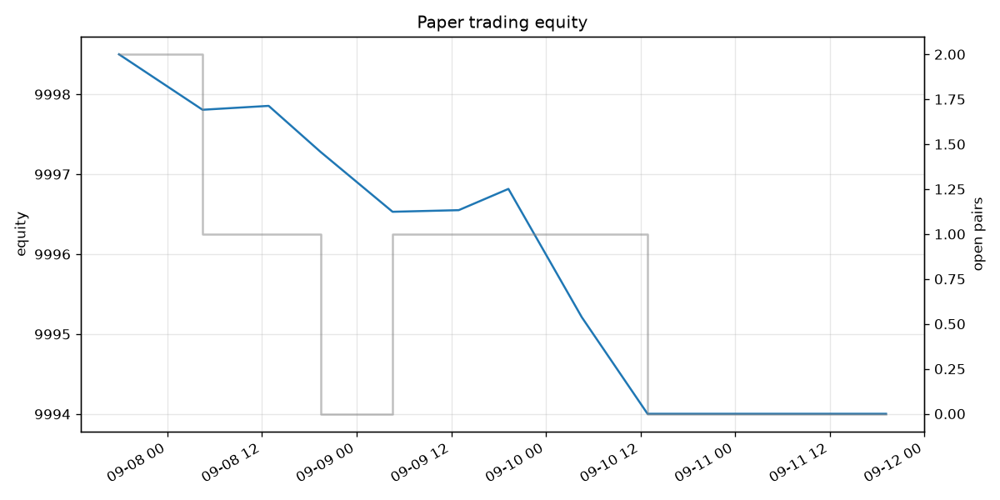

# Paper trading status

Run #13 at 2026-09-11 19:08 UTC. Threshold 0.010% per funding interval, signal = mean of last 3 settled rates. Universe: BTCUSDT, ETHUSDT, SOLUSDT, ZECUSDT, XRPUSDT, BZUSDT, DOGEUSDT, OPENAIUSDT, BNBUSDT, ADAUSDT.

| metric | value |
|---|---|
| equity | 9,994.00 USDT |
| return since start | -0.06% (4.1 days) |
| annualised | -5.40% |
| realized (closed pairs) | -6.00 USDT |
| funding received this run | 0.0000 USDT |
| open pairs | 0 / 10 |
| free cash | 9,994.00 USDT |
| skipped symbols | 0 |

## Positions & risk

| symbol | held | action | signal | mark | spot | funding accrued | basis MTM | margin ratio | liq. price | liq. distance |
|---|---|---|---|---|---|---|---|---|---|---|
| ADAUSDT | no |  | 0.0002% | 0.2045 | 0.2048 | - | - | - | - | - |
| BNBUSDT | no |  | 0.0051% | 723.4000 | 723.9000 | - | - | - | - | - |
| BTCUSDT | no |  | 0.0028% | 77,174.2000 | 77,202.6000 | - | - | - | - | - |
| BZUSDT | no |  | -0.2508% | 100.8200 | 100.8300 | - | - | - | - | - |
| DOGEUSDT | no |  | 0.0018% | 0.0842 | 0.0843 | - | - | - | - | - |
| ETHUSDT | no |  | 0.0029% | 2,543.3100 | 2,543.9800 | - | - | - | - | - |
| OPENAIUSDT | no |  | 0.0000% | 1,484.2400 | 902.3000 | - | - | - | - | - |
| SOLUSDT | no |  | -0.0031% | 101.1900 | 101.2700 | - | - | - | - | - |
| XRPUSDT | no |  | 0.0025% | 1.3532 | 1.3540 | - | - | - | - | - |
| ZECUSDT | no |  | -0.0046% | 1,162.1100 | 1,161.8900 | - | - | - | - | - |

_Margin ratio = maintenance margin / (margin + unrealized) on the isolated perp short; ≥100% means liquidation. Liq. distance = how far mark must rise before liquidation._
