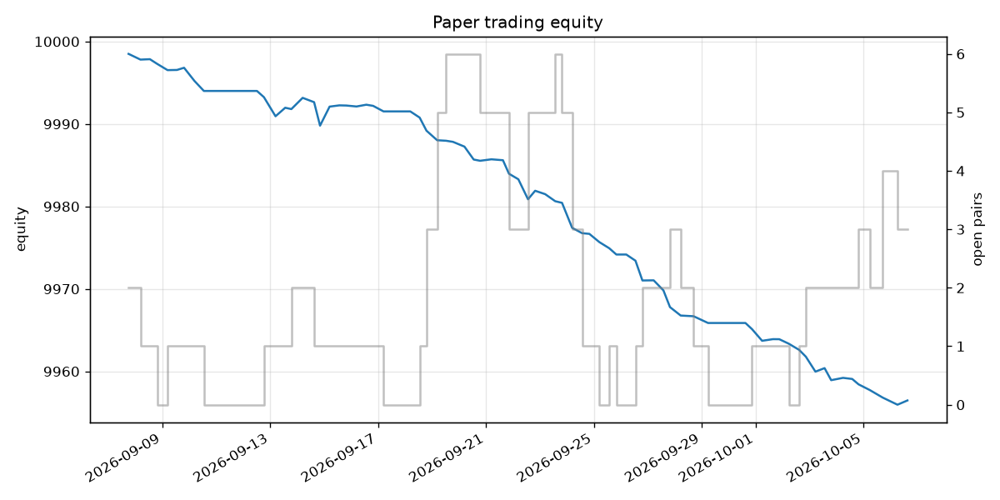

# Paper trading status

Run #80 at 2026-10-04 13:53 UTC. Threshold 0.010% per funding interval, signal = mean of last 3 settled rates. Universe: BTCUSDT, ETHUSDT, SOLUSDT, ZECUSDT, XRPUSDT, BNBUSDT, SANDUSDT, WLDUSDT, DOGEUSDT, NEARUSDT.

| metric | value |
|---|---|
| equity | 9,959.08 USDT |
| return since start | -0.41% (26.8 days) |
| annualised | -5.57% |
| realized (closed pairs) | -39.66 USDT |
| funding received this run | 0.1001 USDT |
| open pairs | 2 / 10 |
| free cash | 7,960.34 USDT |
| skipped symbols | 0 |

## Positions & risk

| symbol | held | action | signal | mark | spot | funding accrued | basis MTM | margin ratio | liq. price | liq. distance |
|---|---|---|---|---|---|---|---|---|---|---|
| NEARUSDT | yes |  | 0.0100% | 4.8784 | 4.8770 | 0.1038 | -0.0606 | 0.54% | 9.3508 | 91.7% |
| ZECUSDT | yes |  | 0.0100% | 1,332.4900 | 1,332.7100 | 0.2855 | -0.0949 | 0.47% | 2,748.8557 | 106.3% |
| BNBUSDT | no |  | 0.0078% | 789.6500 | 790.0000 | - | - | - | - | - |
| BTCUSDT | no |  | 0.0011% | 85,221.5000 | 85,264.6000 | - | - | - | - | - |
| DOGEUSDT | no |  | 0.0067% | 0.0936 | 0.0936 | - | - | - | - | - |
| ETHUSDT | no |  | 0.0020% | 2,697.8000 | 2,698.8700 | - | - | - | - | - |
| SANDUSDT | no |  | -0.3770% | 0.0797 | 0.0797 | - | - | - | - | - |
| SOLUSDT | no |  | 0.0008% | 121.6900 | 121.7600 | - | - | - | - | - |
| WLDUSDT | no |  | 0.0051% | 0.5802 | 0.5805 | - | - | - | - | - |
| XRPUSDT | no |  | 0.0019% | 1.5024 | 1.5027 | - | - | - | - | - |

_Margin ratio = maintenance margin / (margin + unrealized) on the isolated perp short; ≥100% means liquidation. Liq. distance = how far mark must rise before liquidation._
